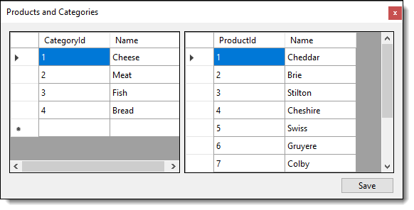

# Getting Started with Windows Forms

How to use EF Core 6 in Windows Forms

[Microsoft article](https://docs.microsoft.com/en-us/ef/core/get-started/winforms)

[Microsoft Source](https://github.com/dotnet/EntityFramework.Docs/tree/main/samples/core/WinForms/GetStartedWinForms)

