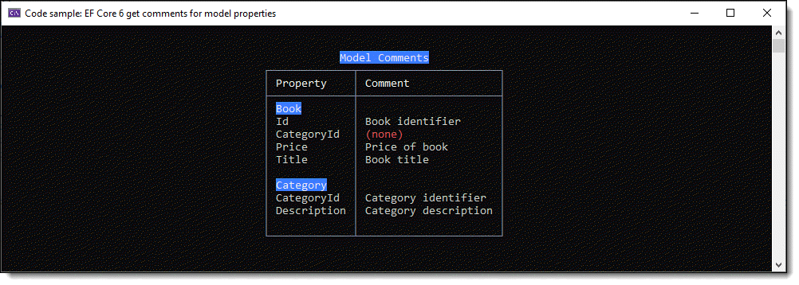

# EF Core 6 get model comments



This project shows how to get, and set, comments for models in a DbContext (which will not work with EF Core 5, see below). The code originally came from EF Core 5 but failed as there were changes to how to get comments/annotations.

If using EF Core 5, see the project EntityCore5Exensions which will not work with EF Core 6.

:small_blue_diamond: Think of comments for properties for providing information to your applicaton from labels to other useful details.

## Setting comments

See the project [ModelCommentsApp1](https://github.com/karenpayneoregon/ef-core-6-tips/tree/master/ModelCommentsApp1) which uses migrations to set column descriptions for each property in the two models into tables in the SQL-Server database.

## Setting up property comments

For this example there are two models, `Book` and `Category`, in the DbContext, `OnModelCreating` we setup properties with comments as follows.

```csharp
protected override void OnModelCreating(ModelBuilder modelBuilder)
{
    modelBuilder.Entity<Book>(entity =>
    {
        entity.Property(e => e.Id).HasComment("Book identifier");
        entity.Property(e => e.Title).HasComment("Book title");
        entity.Property(e => e.Price).HasComment("Price of book");
    });

    modelBuilder.Entity<Category>(entity =>
    {
        entity.Property(e => e.CategoryId).HasComment("Category identifier");
        entity.Property(e => e.Description).HasComment("Category description");
    });
}
```

## Obtaining comments for one model

The language extension Comments accepts the model name as a string, we use `nameof` rather than a literal string so if the model name changes so does the value passed to the extension.

```csharp
private static async Task GetCommentsForBooksModel()
{
    await using var context = new BookContext();

    var comments = context.Comments(nameof(Book));

    foreach (var comment in comments)
    {
        Console.WriteLine($"{comment.Name}, {comment.Comment ?? "(none)"}");
    }
}
```

## Obtaining comments for all models

This is done using the language extension `GetModelNames` which returns the `types` so to get the names we use `Select`, then iterate the models to get comments.

```csharp
private static async Task AllModelComments()
{
    await using var context = new BookContext();

    var models = context.GetModelNames().Select(x => x.Name);

    var table = CreateTable();
    foreach (var model in models)
    {
        table.AddRow($"[white on blue]{model}[/]");
        var comments = context.Comments(model);
        foreach (var comment in comments)
        {
            table.AddRow(comment.Name, comment.Comment ?? "[red](none)[/]");
        }

        table.AddEmptyRow();
    }

    AnsiConsole.Write(table);
}
```

# Summary


