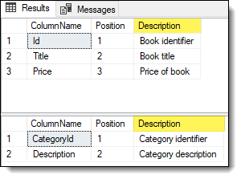

# About

This project shows how to create comments for each property in a model while the project `ModelCommentsApp` showed how to read comments from the DbContext configuration without storing the comments in the database.

As with the project `ModelCommentsApp` we need to configure properties for comments.

```csharp
protected override void OnModelCreating(ModelBuilder modelBuilder)
{
    modelBuilder.Entity<Book>(entity =>
    {
        entity.Property(e => e.Id).HasComment("Book identifier");
        entity.Property(e => e.Title).HasComment("Book title");
        entity.Property(e => e.Price).HasComment("Price of book");
    });

    modelBuilder.Entity<Category>(entity =>
    {
        entity.Property(e => e.CategoryId).HasComment("Category identifier");
        entity.Property(e => e.Description).HasComment("Category description");
    });
}
```

# Install the following NuGet packages

Next we need the following packages to run [migarations](https://docs.microsoft.com/en-us/ef/core/managing-schemas/migrations/?tabs=dotnet-core-cli).

- [Microsoft.EntityFrameworkCore.Tools](https://www.nuget.org/packages/Microsoft.EntityFrameworkCore.Tools/6.0.8?_src=template)
- [Microsoft.EntityFrameworkCore.Design](https://www.nuget.org/packages/Microsoft.EntityFrameworkCore.Design/7.0.0-preview.7.22376.2)

# Package Manager Console

In the console, perform the following steps

1. add-migration FirstMigration [](https://docs.microsoft.com/en-us/ef/core/cli/powershell#add-migration)
1. Update-Database [](https://docs.microsoft.com/en-us/ef/core/cli/powershell#update-database)

From Package Manager Console

```
PM> add-migration FirstMigration
Build started...
Build succeeded.

To undo this action, use Remove-Migration.
PM> Update-Database
Build started...
Build succeeded.
```

Once completed, open SSMS (SQL-Server Management Studio) to the database named `EF.BookCatalog1` defined in `appsettings.json`

Right click on the database `EF.BookCatalog1`, select new query, copy the following SQL into the new query


```sql
SELECT COLUMN_NAME AS ColumnName,
       ORDINAL_POSITION AS Position,
       prop.value AS Description
FROM INFORMATION_SCHEMA.TABLES AS tbl
    INNER JOIN INFORMATION_SCHEMA.COLUMNS AS col
        ON col.TABLE_NAME = tbl.TABLE_NAME
    INNER JOIN sys.columns AS sc
        ON sc.object_id = OBJECT_ID(tbl.TABLE_SCHEMA + '.' + tbl.TABLE_NAME)
           AND sc.name = col.COLUMN_NAME
    LEFT JOIN sys.extended_properties prop
        ON prop.major_id = sc.object_id
           AND prop.minor_id = sc.column_id
           AND prop.name = 'MS_Description'
WHERE tbl.TABLE_NAME = 'Books'
      AND prop.value IS NOT NULL
ORDER BY col.ORDINAL_POSITION;

SELECT COLUMN_NAME AS ColumnName,
       ORDINAL_POSITION AS Position,
       prop.value AS Description
FROM INFORMATION_SCHEMA.TABLES AS tbl
    INNER JOIN INFORMATION_SCHEMA.COLUMNS AS col
        ON col.TABLE_NAME = tbl.TABLE_NAME
    INNER JOIN sys.columns AS sc
        ON sc.object_id = OBJECT_ID(tbl.TABLE_SCHEMA + '.' + tbl.TABLE_NAME)
           AND sc.name = col.COLUMN_NAME
    LEFT JOIN sys.extended_properties prop
        ON prop.major_id = sc.object_id
           AND prop.minor_id = sc.column_id
           AND prop.name = 'MS_Description'
WHERE tbl.TABLE_NAME = 'Categories'
      AND prop.value IS NOT NULL
ORDER BY col.ORDINAL_POSITION;
```

Running the above will produce



# Database comments are scaffolded to code comments

For EF Core 6, Comments on SQL tables and columns are now scaffolded into the entity types created when [reverse-engineering](https://learn.microsoft.com/en-us/ef/core/managing-schemas/scaffolding/?tabs=dotnet-core-cli) an EF Core model from an existing SQL Server database.

```csharp
/// <summary>
/// The Blog table.
/// </summary>
public partial class Blog
{
    /// <summary>
    /// The primary key.
    /// </summary>
    [Key]
    public int Id { get; set; }
}
```


# Summary

In this code sample you learned how to integrate code to set the `Description` properties of columns for each column in a new database using migrations.

