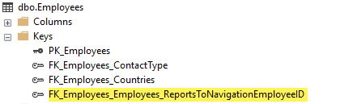
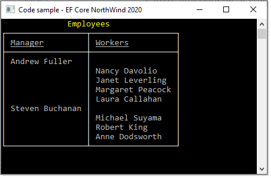

# About


EF Core code samples using a modified version of NorthWind database, script to create and populate is located in the script folder.

- `EmployeeOperations.EmployeeReportsTo` is an example of a self-referencing table for managers and workers.

This is the configuration in EmployeeConfiguration.cs to have a self-referencing table

```csharp
entity.HasOne(d => d.ReportsToNavigation)
    .WithMany(p => p.WorkersNavigation)
    .HasForeignKey(d => d.ReportsTo)
    .HasConstraintName("FK_Employees_Employees");
```

</br>




</br>




