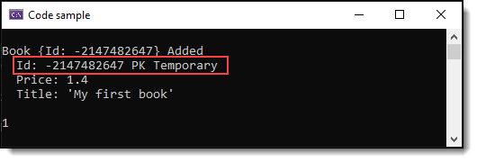
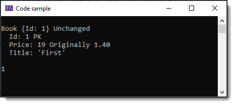
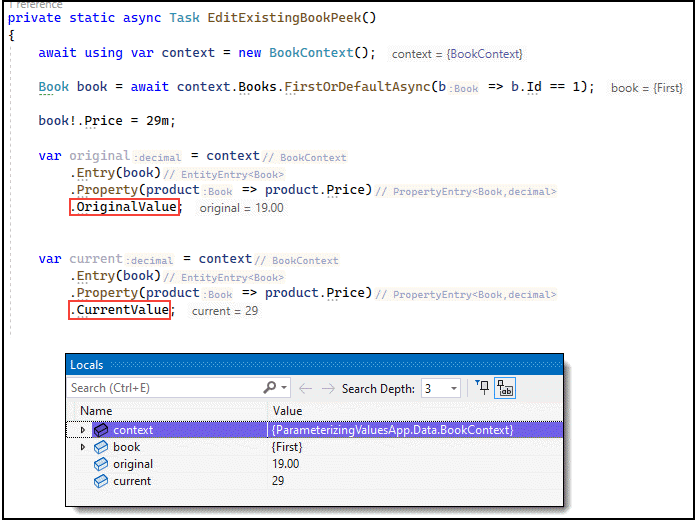

# About

When working with data in EF Core, all values passed in as variables are parameterized by EF Core when using a variable rather than hard coding a value into say a Where condition. This ensure that there is no chance of SQL injection in regards to injecting hacked values in place of your values.

This article has code samples demonstrating how EF Core sees your query using various methods for logging to the console or to a file.

At program start the database is created each time the program runs and populates tables so each run has expected data.

Things to pay attention to in code, `ChangeTracker.DebugView.LongView`, there is also `ChangeTracker.DebugView.ShortView` not used here and `ToQueryString` which both are explained below.

## SQL-Injection

Most developers the following is a clear picture of SQL-Injection, values are passed to a command object which can be hacked

```csharp
private static bool UpdateBad(string cardNumber, string pin, decimal deposit)
{
    using var cn = new SqlConnection("Data Source=MAD-PC-023;Database=atmbd;Trusted_Connection=True;");
    using var cmd = new SqlCommand
    {
        Connection = cn,
        CommandText = $"""
        UPDATE atmbd.atm 
            SET Balance = Balance + {deposit} 
        WHERE CardNumber = {cardNumber} AND Pin = {pin}
        """
    };

    cn.Open();
    return cmd.ExecuteNonQuery() == 1;
}
```

While the following, using parameters can not be hacked

```csharp
private static bool Update(string cardNumber, string pin, decimal deposit)
{
    using var cn = new SqlConnection("Data Source=MAD-PC-023;Database=atmbd;Trusted_Connection=True;");
    using var cmd = new SqlCommand
    {
        Connection = cn,
        CommandText = 
            """
                UPDATE atmbd.atm 
                    SET Balance = Balance + @Deposit 
                WHERE CardNumber = @CardNumber AND Pin = @Pin
            """
    };
                
    cmd.Parameters.Add("@CardNumber", SqlDbType.NChar).Value = cardNumber;
    cmd.Parameters.Add("@Pin", SqlDbType.NChar).Value = pin;
    cmd.Parameters.Add("@Deposit", SqlDbType.Decimal).Value = deposit;

    cn.Open();
    return cmd.ExecuteNonQuery() == 1;
}
```

The same hold true for EF Core.

Bad

```csharp
context.Books.Add(new Book()
{
    Price = value, 
    Title = bookTitle, 
    CategoryId = 1, 
    Category = context.Categories.FirstOrDefault(x => x.CategoryId == 1)
});
```

Good 

```csharp
int categoryIdentifier = 1;
context.Books.Add(new Book()
{
    Price = value, 
    Title = bookTitle, 
    CategoryId = categoryIdentifier, 
    Category = context.Categories.FirstOrDefault(x => x.CategoryId == categoryIdentifier)
});
```


## Viewng data while developing

- Write to a log file, which is presented using `DbContextToFileLogger` class and setip in `BookContext` in `CustomLogging`
- Write to the console
    - [ChangeTracker.DebugView](https://learn.microsoft.com/en-us/ef/core/change-tracking/debug-views) shown in `Program.InsertNewBook`
    - [ToQueryString](https://learn.microsoft.com/en-us/dotnet/api/microsoft.entityframeworkcore.entityframeworkqueryableextensions.toquerystring?view=efcore-7.0) shown in `Program.ToQueryStringExample`


There are various options for setting up viewing EF Core data, in BookContext there are the following.

```csharp
/// <summary>
/// Setup connection for no logging and no change tracking
/// </summary>
public static void NoLogging(DbContextOptionsBuilder optionsBuilder)
{

    optionsBuilder
        .UseSqlServer(ConnectionString())
        .UseQueryTrackingBehavior(QueryTrackingBehavior.NoTracking);

}
```

</br>

```csharp
/// <summary>
/// Setup connection
/// Log to Visual Studio's output window
/// </summary>
public static void StandardLogging(DbContextOptionsBuilder optionsBuilder)
{
        
    optionsBuilder
        .UseSqlServer(ConnectionString())
        .EnableSensitiveDataLogging()
        .LogTo(message => Debug.WriteLine(message));

}
```


</br>

```csharp
/// <summary>
/// Setup connection
/// Slimmed down to specific details
/// </summary>
private static void DatabaseCategoryLogging(DbContextOptionsBuilder optionsBuilder)
{

    optionsBuilder
        .UseSqlServer(ConnectionString())
        .EnableSensitiveDataLogging()
        .LogTo(message => Debug.WriteLine(message),
            new[] { DbLoggerCategory.Database.Command.Name },
            LogLevel.Information,
            DbContextLoggerOptions.UtcTime);

}
```

</br>

```csharp
    /// <summary>
    /// Setup connection
    /// Writes/appends to a file
    /// </summary>
    private static void CustomLogging(DbContextOptionsBuilder optionsBuilder)
    {

        optionsBuilder
            .UseSqlServer(ConnectionString())
            .EnableSensitiveDataLogging()
            .LogTo(new DbContextToFileLogger().Log)
            .EnableDetailedErrors();

    }
```

### Using a third party library

There are a number of logging libraries, for this article we will use SeriLog which is easy to use and easy (for the most part) to configure via code or via settings in appsettings.json file.

NuGet packages

- [Serilog](https://www.nuget.org/packages/Serilog/2.12.1-dev-01635) base library
- [Serilog.Sinks.Console](https://www.nuget.org/packages/Serilog.Sinks.Console/4.1.1-dev-00901) for writing to the console
- [Serilog.Sinks.File]https://www.nuget.org/packages/Serilog.Sinks.File/5.0.1-dev-00947) for writing to files

For this project, SeriLog is setup under Classes\Program.cs. I recomment commenting out the `.WriteTo.Console(theme: AnsiConsoleTheme.Code)` for this project as the `.WriteTo.File(Path.Combine(AppDomain.CurrentDomain.BaseDirectory, "LogFiles", "EF-Log.txt")` captures the same information.

```csharp
Log.Logger = new LoggerConfiguration()
    .MinimumLevel.Verbose()
    .WriteTo.Console(theme: AnsiConsoleTheme.Code)
    .WriteTo.File(Path.Combine(AppDomain.CurrentDomain.BaseDirectory, "LogFiles", "EF-Log.txt"),
        rollingInterval: RollingInterval.Day,
        outputTemplate: "[{Timestamp:yyyy-MM-dd HH:mm:ss.fff} [{Level}] {Message}{NewLine}{Exception}")
    .CreateLogger();
```

For a web app, in prgram.cs

```csharp
if (builder.Environment.IsDevelopment())
{
    Log.Logger = new LoggerConfiguration()
        .MinimumLevel.Verbose()
        .WriteTo.Console(theme: AnsiConsoleTheme.Code)
        .WriteTo.File(Path.Combine(AppDomain.CurrentDomain.BaseDirectory, "LogFiles", "Log.txt"), 
            rollingInterval: RollingInterval.Day, 
            outputTemplate: "[{Timestamp:yyyy-MM-dd HH:mm:ss.fff} [{Level}] {Message}{NewLine}{Exception}")
        .CreateLogger();
```

In BookContext a new option has been added for SeriLog

```csharp
private static void SeriLogging(DbContextOptionsBuilder optionsBuilder)
{

    optionsBuilder
        .UseSqlServer(ConnectionString())
        .EnableSensitiveDataLogging()
        .LogTo(Log.Logger.Information, LogLevel.Information, null)
        .EnableDetailedErrors();

}
```


## INSERT opterations

When adding a new record, a `Book` EF Core passes data to SQL-Server parameterized which pervents SQL Injection.


```csharp
private static async Task InsertNewBook()
{
    await using var context = new BookContext();

    decimal value = 1.4m;
    string bookTitle = "My first book";
    context.Books.Add(new Book() { Price = value, Title = bookTitle });
    Console.WriteLine(await context.SaveChangesAsync());
}
```

```
Executed DbCommand (52ms) [Parameters=[@p0='?' (Precision = 18) (Scale = 2) (DbType = Decimal), @p1='?' (Size = 4000)], CommandType='Text', CommandTimeout='30']
SET NOCOUNT ON;
INSERT INTO [Books] ([Price], [Title])
VALUES (@p0, @p1);
SELECT [Id]
FROM [Books]
WHERE @@ROWCOUNT = 1 AND [Id] = scope_identity();

```

How to get the command above, the following method is added to the `DbContext`.

```csharp
private static void DatabaseCategoryLogging(DbContextOptionsBuilder optionsBuilder)
{

    optionsBuilder.UseSqlServer(ConfigurationHelper.ConnectionString())
         .LogTo(message => Debug.WriteLine(message),
            new[] { DbLoggerCategory.Database.Command.Name },
            LogLevel.Information,
            DbContextLoggerOptions.UtcTime);
}
```

Followed by invoking the above method in the same DbContext

```csharp
protected override void OnConfiguring(DbContextOptionsBuilder optionsBuilder)
{
    DatabaseCategoryLogging(optionsBuilder);
}
```

To see the actual values (do this only in development, not production) which added [EnableSensitiveDataLogging](https://docs.microsoft.com/en-us/dotnet/api/microsoft.entityframeworkcore.dbcontextoptionsbuilder.enablesensitivedatalogging?view=efcore-6.0).

```csharp
private static void DatabaseCategoryLogging(DbContextOptionsBuilder optionsBuilder)
{

    optionsBuilder.UseSqlServer(ConfigurationHelper.ConnectionString())
        .EnableSensitiveDataLogging()
        .LogTo(message => Debug.WriteLine(message),
            new[] { DbLoggerCategory.Database.Command.Name },
            LogLevel.Information,
            DbContextLoggerOptions.UtcTime);
}
```

Run the INSERT again and we can see the values


```
Executed DbCommand (54ms) [Parameters=[@p0='1.4' (Precision = 18) (Scale = 2), @p1='My first book' (Size = 4000)], CommandType='Text', CommandTimeout='30']
SET NOCOUNT ON;
INSERT INTO [Books] ([Price], [Title])
VALUES (@p0, @p1);
SELECT [Id]
FROM [Books]
WHERE @@ROWCOUNT = 1 AND [Id] = scope_identity();
```

Another option is to use [ChangeTracker.DebugView](https://docs.microsoft.com/en-us/ef/core/change-tracking/debug-views) as shown below.



```csharp
private static async Task InsertNewBook()
{
    await using var context = new BookContext();

    decimal value = 1.4m;
    string bookTitle = "My first book";
    context.Books.Add(new Book() { Price = value, Title = bookTitle });

    Console.WriteLine(context.ChangeTracker.DebugView.LongView);
    Console.WriteLine(await context.SaveChangesAsync());
}
```

## EDIT operations

Modifying an existing record is no different than adding a new record other than we can see the original and new value but only when change tracking is enabled and the same DbContext is used, not in disconnected mode.



```csharp
private static async Task EditExistingBook()
{
    await using var context = new BookContext();

    Book book = await context.Books.FirstOrDefaultAsync(b => b.Id == 1);

    book.Price = 19m;

    Console.WriteLine(context.ChangeTracker.DebugView.LongView);
    Console.WriteLine(await context.SaveChangesAsync());
}
```

Another option is to ask for original and new value.



## See also

:pushpin:  [Query tags](http://example.com) Query tags help correlate LINQ queries in code with generated SQL queries captured in logs. You annotate a LINQ query using the new `TagWith()` method. Note that this works great with limited amount of transations for a database while I've worked for companies were there are literally thousands of transactions per second which means it can be difficult to rely on `TagWith` method.

## Summary

Learn from samples provided to use variables when passing information to EF Core and how to use what has been presented to assist in debugging queries.

