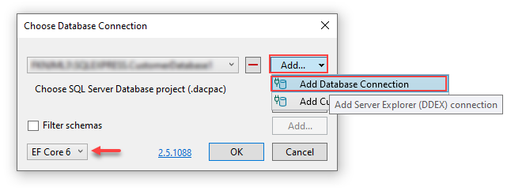
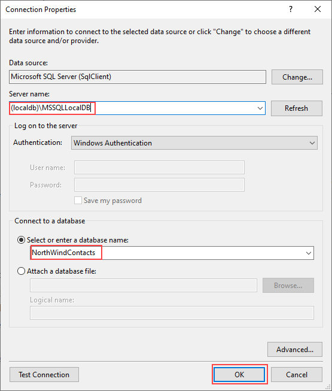
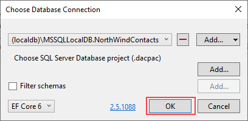
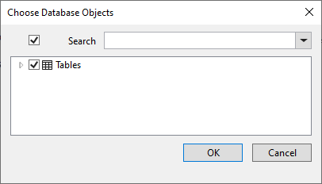
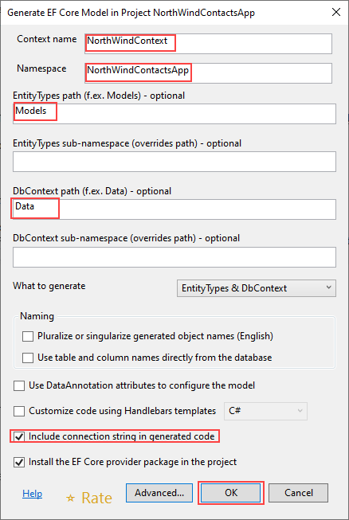
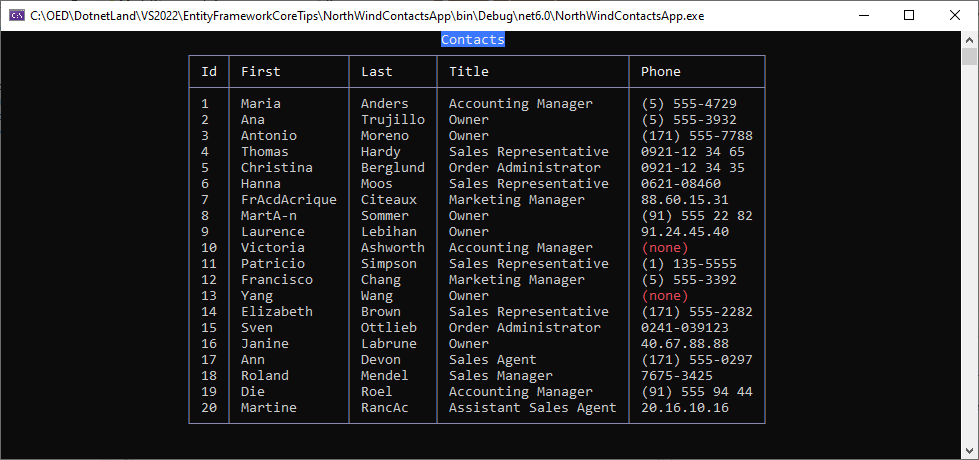

# Reverse Engineer a SQL-Server database with EF Power Tools


In this article learn how to create a database with three tables in SSMS (SQL-Server Management Studio) followed by creating POCO classes which will represent tables in the new database. 

Once the POCO classes [^1] have been created with EF Power Tools [^2] we will write a few queries.

Before starting you will need Microsoft Visual Studio 2022 or higher and Microsoft SSMS.

## Create the database

1. Open SSMS
1. Open a connection to `(localdb)\MSSQLLocalDB` 
1. From `Object Explorer`, right click on `Databases`
1. Select `New database`
1. Enter `NorthWindContacts` for the database name, click OK
1. Right click on `NorthWindContacts`, select `New query`
1. Back in Visual Studio, open NorthWindContacts.sql, copy the contents
1. Back in SSMS, paste the contents into the new query
1. Click `Execute`
1. Right click on `NorthWindContacts` and select `Refesh`, there should be three tables.

## Install EF Core Power Tools

1. With Visual Studio closes, download EF Power Tools from the following [link](https://marketplace.visualstudio.com/items?itemName=ErikEJ.EFCorePowerTools).
1. Double click on the download, follow the prompts

## Open Visual Studio to this solution

1. Right click on the top node in Solution Explorer
1. Select create a new Console project (check do not use top down statements) named NorthWindContactsApp
1. Right click on the project name in Solution Explorer, select `Manage NuGet packages`
1. On the Browse tab, paste in `Microsoft.EntityFrameworkCore.SqlServer`, click `Install` or use the NuGet command prompt `Install-Package Microsoft.EntityFrameworkCore -Version 6.0.8`
1. Right click on the project name in Solution Explorer
1. Select `EF Power Tools`
1. Select `Reverse Engineer`
1. Configure a new database connection (see figure 1)
1. Set connection properties (see figure 2)
1. Accept (see figue 3)
1. Select tables (see figure 4)
1. Next, set several settings (see figure 5)
    1. **Context name**: `NorthWindContext`
    1. **Namespace**: `NorthWindContactsApp`
    1. **EntityTypes**: `Models`
    1. **DbCotext path**: `Data`
    1. **Check** `Include connection string` in generated code (okay for learning but should not be done for a real app)

**Figure 1**



**Figure 2**



**Figure 3**



**Figure 4**



**Figure 5**



## Add another package to the project

Add the NuGet package [Spectre.Console](https://www.nuget.org/packages/Spectre.Console) to the project

## Write code to get data

Open Program.cs and replace the contents with the following which will select the top 20 contacts into a table shown below

```csharp
using Microsoft.EntityFrameworkCore;
using NorthWindContactsApp.Data;
using Spectre.Console;

namespace NorthWindContactsApp
{
    internal class Program
    {
        static void Main(string[] args)
        {
            using var context = new NorthWindContext();

            var contacts = context.Contacts
                .Include(x => x.ContactTypeIdentifierNavigation)
                .Include(x => x.ContactDevices)
                .Take(20)
                .ToList();


            var table = CreateTable();

            foreach (var contact in contacts)
            {
                if (contact.ContactDevices.Any())
                {
                    table.AddRow(contact.ContactId.ToString(), 
                        contact.FirstName, 
                        contact.LastName, 
                        contact.ContactTypeIdentifierNavigation.ContactTitle, 
                        contact.ContactDevices.FirstOrDefault()!.PhoneNumber);
                }
                else
                {
                    table.AddRow(contact.ContactId.ToString(), 
                        contact.FirstName, 
                        contact.LastName, 
                        contact.ContactTypeIdentifierNavigation.ContactTitle, 
                        "[red](none)[/]");
                }
            }

            AnsiConsole.Write(table);
            Console.ReadLine();
        }
        private static Table CreateTable()
        {
            return new Table()
                .RoundedBorder().BorderColor(Color.LightSlateGrey)
                .AddColumn("[b]Id[/]")
                .AddColumn("[b]First[/]")
                .AddColumn("[b]Last[/]")
                .AddColumn("[b]Title[/]")
                .AddColumn("[b]Phone[/]")
                .Alignment(Justify.Center)
                .Title("[white on blue]Contacts[/]");
        }
    }
}
```

Run the project and the following shows the top 20 contacts



# Next steps

- Study the code to get an understanding how things work
- Read Microsoft [docs](https://docs.microsoft.com/en-us/ef/core/) on EF Core
- Remove the connection string from `NorthWindContext.cs` and place into `appsettings.json`. Look at the project `ModelCommentsApp`, `appsettings.json` has the connection string. A NuGet package, [ConfigurationLibrary](https://www.nuget.org/packages/ConfigurationLibrary/1.0.1?_src=template) is used to set the connection string in `BookContext.cs` in `OnConfiguring` and note there are several options to log or not log EF Core operations.


[^1]: A POCO entity is a class that doesn't depend on any framework-specific base class. It is like any other normal .NET CLR class, which is why it is called "Plain Old CLR Objects".

[^2]: Useful design-time DbContext features, added to the Visual Studio Solution Explorer context menu. When right-clicking on a C# project, the following context menu functions are available: Reverse Engineer - Generates POCO classes,