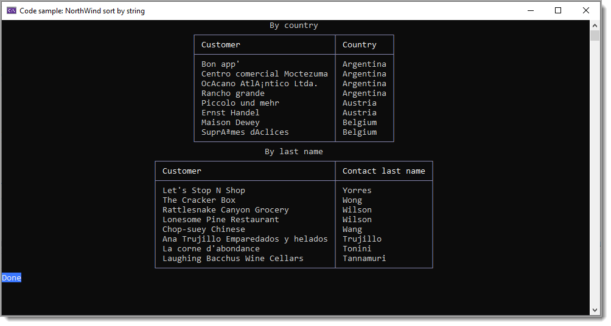

# Tip: How to order by a Navigation property dynamically

In this article, learn how to perform order by using Entity Framework Core where order by are dynamic on navigation properties.

Typically an order by is done using code similar to this

```csharp
using var context = new NorthWindContext();
var customers = context.Customers
    .Include(c => c.Contact)
    .Include(c => c.ContactTypeNavigation)
    .OrderBy(c => c.ContactTypeNavigation.ContactTitle)
    .ToList();
```
But suppose a requirement is to allow dynamic ordering, so instead of ordering by ContactTitle the requirement is to order by a contact first or last name or their country. 

One option is shown below 

Setup an `enum` for direction of the ordering

```csharp
public enum Direction
{
    /// <summary>
    /// Sort ascending.
    /// </summary>
    Ascending,
    /// <summary>
    /// Sort descending.
    /// </summary>
    Descending
}
```

Followed by a method which accepts a property name.

```csharp
public static IQueryable<Customers> OrderByString(this IQueryable<Customers> query, string key, Direction direction = Direction.Ascending)
{
    Expression<Func<Customers, object>> exp = key switch
    {
        "LastName" => customer => customer.Contact.LastName,
        "FirstName" => customer => customer.Contact.FirstName,
        "CountryName" => customer => customer.CountryNavigation.Name,
        "Title" => customer => customer.ContactTypeNavigation.ContactTitle,
        _ => customer => customer.CompanyName
    };

    return direction == Direction.Ascending ? query.OrderBy(exp) : query.OrderByDescending(exp);
}
```

Usage

```csharp
public static async Task<List<Customers>> SortByPropertySecondAttempt(string propertyName)
{
    await using var context = new NorthWindContext();
    return await context.Customers
        .Include(c => c.CountryNavigation)
        .OrderByString(propertyName, Direction.Ascending)
        .ToListAsync();
}
```


Although this works, if a key changes or not typed in properly the method will default to the default order, `CompanyName`

A better option, rather than passing the key as a string, use a `enum`

```csharp
public enum PropertyAlias
{
    FirstName,
    LastName,
    CountryName,
    Title
}
```

Now the key is a enum which means no mistakes as with a string shown above.

```csharp
public static IQueryable<Customers> OrderByEnum(this IQueryable<Customers> query, PropertyAlias key, Direction direction = Direction.Ascending)
{
    Expression<Func<Customers, object>> exp = key switch
    {
        PropertyAlias.LastName => customer => customer.Contact.LastName,
        PropertyAlias.FirstName => customer => customer.Contact.FirstName,
        PropertyAlias.CountryName => customer => customer.CountryNavigation.Name,
        PropertyAlias.Title => customer => customer.ContactTypeNavigation.ContactTitle,
        _ => customer => customer.CompanyName
    };

    return direction == Direction.Ascending ? query.OrderBy(exp) : query.OrderByDescending(exp);
}
```

Usage

```csharp
await using var context = new NorthWindContext();
List<Customers> customers = await context.Customers
    .Include(c => c.CountryNavigation)
    .OrderByEnum(PropertyAlias.CountryName, Direction.Ascending)
    .ToListAsync();
```

That covers dynamic ordering of navigations, for top level ordering consider the following method which requires the property name as a string.

```csharp
public static List<T> OrderByPropertyName<T>(this List<T> list, string propertyName, Direction sortDirection)
{

    ParameterExpression param = Expression.Parameter(typeof(T), "item");

    Expression<Func<T, object>> sortExpression = 
        Expression.Lambda<Func<T, object>>(Expression.Convert(Expression.Property(param, propertyName), typeof(object)), param);

    list = sortDirection switch
    {
        Direction.Ascending => list.AsQueryable().OrderBy(sortExpression).ToList(),
        _ => list.AsQueryable().OrderByDescending(sortExpression).ToList()
    };

    return list;

}
```

Since the method calls for the property name as a string, here is a method to get model names for a DbContext which in turn allows us to get property names in the second code block.

```csharp
public static List<string> GetDatabaseModels()
{
    using var context = new NorthWindContext();

    return context.GetModelNames().Select(type => type.Name).ToList();
}
```

Code to get property names for a model.

```csharp
public static List<SqlColumn> GetModelProperties(this DbContext context, string modelName)
{

    if (context == null) throw new ArgumentNullException(nameof(context));

    var entityType = GetEntityType(context, modelName);

    var list = new List<SqlColumn>();

    IEnumerable<IProperty> properties = context.Model
        .FindEntityType(entityType ?? throw new InvalidOperationException())!
        .GetProperties();

    foreach (IProperty itemProperty in properties)
    {
        SqlColumn sqlColumn = new SqlColumn
        {
            Name = itemProperty.Name,
            IsPrimaryKey = itemProperty.IsKey(),
            IsForeignKey = itemProperty.IsForeignKey(),
            IsNullable = itemProperty.IsColumnNullable()
        };


        list.Add(sqlColumn);

    }

    return list;

}
```


Our model will be a slimmed down version of NorthWind2022 used in [NorthWind2022Library](https://github.com/karenpayneoregon/ef-core-6-tips/tree/master/NorthWind2022Library) class project


We want to order by `contact title`, this is easy but suppose the client want the ability to order by contact first/last name or country? This is generally done with a if-else statement but there is a cleaner way/

```csharp
using var context = new NorthWindContext();
var customers = context.Customers
    .Include(c => c.Contact)
    .Include(c => c.ContactTypeNavigation)
    .OrderBy(c => c.ContactTypeNavigation.ContactTitle)
    .ToList();
```

Setup an `enum` for each property the client wants e.g.

```csharp
public enum BaseProperty
{
    FirstName,
    LastName,
    CountryName,
    Title
}
```

Next, create a method which accepts a member of `BaseProperty` then build an expression of the `key`. The default is to order by the main property, CompanyName.

```csharp
public static IQueryable<Customers> OrderByEnum(this IQueryable<Customers> query, BaseProperty key, Direction direction = Direction.Ascending)
{
    Expression<Func<Customers, object>> exp = key switch
    {
        BaseProperty.LastName => customer => customer.Contact.LastName,
        BaseProperty.FirstName => customer => customer.Contact.FirstName,
        BaseProperty.CountryName => customer => customer.CountryNavigation.Name,
        BaseProperty.Title => customer => customer.ContactTypeNavigation.ContactTitle,
        _ => customer => customer.CompanyName
    };

    return direction == Direction.Ascending ? query.OrderBy(exp) : query.OrderByDescending(exp);
}
```

## Code samples

- SortCustomerOnCountryName, sort on included table for countries
- SortCustomerOnContactLastName, sort on included table for contacts

Why use an `enum`? if for no other reason over a string is we are strongly typed with an enum while a string must be manually update by the developer and error-prone. Along with `OrderByEnum` I have included a string version of that is more desirable.

```csharp
public static IQueryable<Customers> OrderByString(this IQueryable<Customers> query, string key, Direction direction = Direction.Ascending)
{
    Expression<Func<Customers, object>> exp = key switch
    {
        "LastName" => customer => customer.Contact.LastName,
        "FirstName" => customer => customer.Contact.FirstName,
        "CountryName" => customer => customer.CountryNavigation.Name,
        "Title" => customer => customer.ContactTypeNavigation.ContactTitle,
        _ => customer => customer.CompanyName
    };

    return direction == Direction.Ascending ? query.OrderBy(exp) : query.OrderByDescending(exp);
}
```




# Dynamic order by on top level model

This method provide ordering by string name which is error prone as a mistyped property name may be entered.

```csharp
public static List<T> OrderByPropertyName<T>(this List<T> list, string propertyName, Direction sortDirection)
{

    ParameterExpression param = Expression.Parameter(typeof(T), "item");

    Expression<Func<T, object>> sortExpression = Expression.Lambda<Func<T, object>>(Expression.Convert(Expression.Property(param, propertyName), typeof(object)), param);

    list = sortDirection switch
    {
        Direction.Ascending => list.AsQueryable().OrderBy(sortExpression).ToList(),
        _ => list.AsQueryable().OrderByDescending(sortExpression).ToList()
    };

    return list;

}
```

To ensure a valid property name is entered, create the following class which will be used to get property names for a specific model.

```csharp
public class SqlColumn
{
    public bool IsPrimaryKey { get; set; }
    public bool IsForeignKey { get; set; }
    public bool IsNullable { get; set; }
    /// <summary>
    /// Column/property name
    /// </summary>
    public string Name { get; set; }
    /// <summary>
    /// Description/comment from table definition in database table
    /// </summary>
    public string Description { get; set; }
    public override string ToString() => Name;

}
```

Method to get properties using the above class.

```csharp
public static List<SqlColumn> GetModelProperties(this DbContext context, string modelName)
{

    if (context == null) throw new ArgumentNullException(nameof(context));

    var entityType = GetEntityType(context, modelName);

    var list = new List<SqlColumn>();

    IEnumerable<IProperty> properties = context.Model
        .FindEntityType(entityType ?? throw new InvalidOperationException())!
        .GetProperties();

    foreach (IProperty itemProperty in properties)
    {
        SqlColumn sqlColumn = new SqlColumn
        {
            Name = itemProperty.Name,
            IsPrimaryKey = itemProperty.IsKey(),
            IsForeignKey = itemProperty.IsForeignKey(),
            IsNullable = itemProperty.IsColumnNullable()
        };


        list.Add(sqlColumn);

    }

    return list;

}
```

The following method will obtain all models for a DbContext which in turn is used with the method above.

```csharp
public static List<Type> GetModelNames(this DbContext context)
{
    if (context == null) throw new ArgumentNullException(nameof(context));
    return context.Model.GetEntityTypes().Select(et => et.ClrType).ToList();
}
```

The method `GetModelNames` can than populate a dropdown in the user interface where the user selects a model and code behind provides property names to use for ordering with `OrderByPropertyName`.

All the code for this can be found in the project [EntityFrameworkCoreHelpers](https://github.com/karenpayneoregon/ef-core-6-tips/tree/master/EntityFrameworkCoreHelpers).


# Summary


