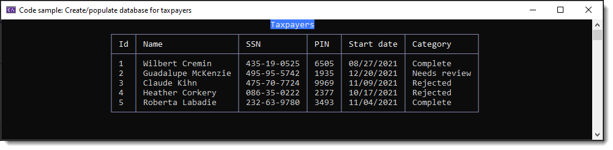
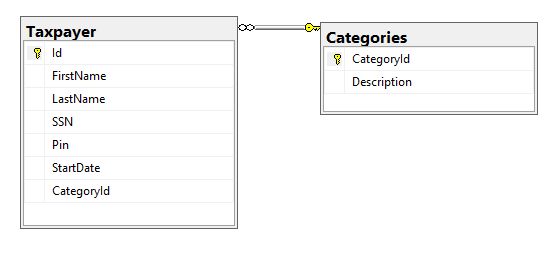

# About



This project demonstrates dynamically creating a SQL-Server LocalDb database using EF Core and Bogus.


# Generating database on the fly

This is done by EF Core looking to the DbContext, get the DbSet objects, looks at the models for the DbSet objects then if a model has an int property named Id or ends in Id creates primary and foreign keys which is also dependent on properties that are from another model which can be a single instance or a list.

Given

```csharp
public partial class Taxpayer
{
    public int Id { get; set; }
    public string FirstName { get; set; }
    public string LastName { get; set; }
    public string FullName => $"{FirstName} {LastName}";
    public string SSN { get; set; }
    public string SocialSecurityNumber => SSN.Insert(5, "-").Insert(3, "-");
    public string Pin { get; set; }
    public DateTime? StartDate { get; set; }
    public int CategoryId { get; set; }
    public Category Category { get; set; }
    public override string ToString() => $"{FirstName} {LastName}";
}

public class Category
{
    [Key]
    public int CategoryId { get; set; }
    public string Description { get; set; }
    public List<Taxpayer> Taxpayers { get; set; }

    public Category()
    {
        Taxpayers = new List<Taxpayer>();
    }
}
```

EF Core generates



