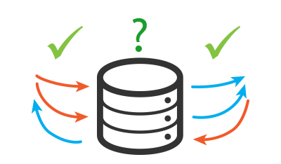

# EF Core Handling Concurrency Conflicts



[From Microsoft](https://learn.microsoft.com/en-us/ef/core/saving/concurrency)

*Database concurrency refers to situations in which multiple processes or users access or change the same data in a database at the same time. Concurrency control refers to specific mechanisms used to ensure data consistency in presence of concurrent changes.*

*EF Core implements optimistic concurrency control, meaning that it will let multiple processes or users make changes independently without the overhead of synchronization or locking. In the ideal situation, these changes will not interfere with each other and therefore will be able to succeed. In the worst case scenario, two or more processes will attempt to make conflicting changes, and only one of them should succeed.*

---

Although Microsoft provides a simple example in this article the data source used is used for other code samples in this repostitory so there is consistency from code sample to code sample.

[Serilog](https://serilog.net/) NuGet package is used to log what goes on under the covers which will help to better understand how dealing with concurrency wonflicts works and what information is available to a developer.

```
2022-09-18 09:12:41.227 -07:00 [INF] There were conflicts, aborting saving data
DataOperations.Update

2022-09-18 09:17:57.689 -07:00 [INF] There were conflicts, aborting saving data
In DataOperations.Update
Using values from the database

2022-09-18 09:18:33.260 -07:00 [INF] 
DataOperations.UpdateWithCurrentLocalValues
DbUpdateConcurrencyException
Name                     Local value               Database value
Key                      1
FirstName                Karen                     Dummy first name
LastName                 Payne                     Dummy last name
Pin                      4873                      8053
SSN                      111223333                 866801328
StartDate                8/19/2003 5:04:01 AM      8/18/2021 12:00:00 AM
```

# Concurrency check setup

To setup for concurrency checks, in the model below we use [ConcurrencyCheck](https://learn.microsoft.com/en-us/dotnet/api/system.componentmodel.dataannotations.concurrencycheckattribute?view=net-6.0) on properties in a model we want to know about concurrency violations.

```csharp
public class Taxpayer
{
    public int Id { get; set; }
    [ConcurrencyCheck]
    public string FirstName { get; set; }

    [ConcurrencyCheck]
    public string LastName { get; set; }

    [JsonIgnore]
    public string FullName => $"{FirstName} {LastName}";
    [ConcurrencyCheck]
    public string SSN { get; set; }
    
    [JsonIgnore]
    public string SocialSecurityNumber =>
        SSN.Insert(5, "-").Insert(3, "-");

    [ConcurrencyCheck]
    public string Pin { get; set; }

    [ConcurrencyCheck]
    public DateTime? StartDate { get; set; }

    [ConcurrencyCheck]
    public int CategoryId { get; set; }
    public Category Category { get; set; }

    public override string ToString() => $"{FirstName} {LastName}";
}
```

Or Fluent API (in the DbContext)


```csharp
protected override void OnModelCreating(ModelBuilder modelBuilder)
{
    modelBuilder.ApplyConfiguration(new Configurations.TaxpayerConfiguration());

    modelBuilder.Entity<Taxpayer>()
        .Property(t => t.FirstName)
        .IsConcurrencyToken();

    modelBuilder.Entity<Taxpayer>()
        .Property(t => t.LastName)
        .IsConcurrencyToken();

    modelBuilder.Entity<Taxpayer>()
        .Property(t => t.SSN)
        .IsConcurrencyToken();

    modelBuilder.Entity<Taxpayer>()
        .Property(t => t.Pin)
        .IsConcurrencyToken();

    modelBuilder.Entity<Taxpayer>()
        .Property(t => t.StartDate)
        .IsConcurrencyToken();

    modelBuilder.Entity<Taxpayer>()
        .Property(t => t.CategoryId)
        .IsConcurrencyToken();

    OnModelCreatingPartial(modelBuilder);
}
```

# Setup for testing

Usin the console project `TaxpayerMocking` which reads the DbContext in the class project `TaxpayerLibraryEntityVersion` to create a new database with random data using NuGet package [Bogus](https://www.nuget.org/packages/Bogus/34.0.2?_src=template). This needs to be done as each time the main project (in this case) `TaxpayersConcurrencyCheck` will modify data so that a [DbUpdateConcurrencyException](https://learn.microsoft.com/en-us/dotnet/api/system.data.entity.infrastructure.dbupdateconcurrencyexception?view=entity-framework-6.2.0) is throw.

## Test

There are three scenarios, when a concurrency violation is thrown

- Use the local values of the application, write to a log file.
- Use the values in the database, write to a log file
- Take no action, inform the caller the save changes failed and write to a log file

### Favor local changes

First obtain a single `Taxpayer`, once read, perform an update to the database with values which may have come from another user just saving the record we are working on which in turn when this app attempts to execure `SaveChanges`, EF Core will throw a `DbUpdateConcurrencyException`. Next we make changes to properties of the Taxpayer just read from the database followed by attempting to save changes to the database.

Code to set the stage for saving to the database

```csharp
private static async Task UpdateWithDatabaseValues()
{
    int id = 1;
    var taxpayer = await DataOperations.GetTaxpayerByIdentity(id);

    await DataOperations.OedContext.Database.ExecuteSqlRawAsync(
        "UPDATE dbo.Taxpayer SET FirstName = 'Dummy first name', LastName = 'Dummy last name' " +
        $"WHERE Id = {id}");

    var date = new RandomDateTime();
    taxpayer.FirstName = "Karen";
    taxpayer.LastName = "Payne";
    taxpayer.Pin = "4873";
    taxpayer.StartDate = date.Next();
    var (success, exception) = await DataOperations.UpdateWithCurrentDatabaseValues(taxpayer);
}
```

Code to attempt to save change with a try/catch

1. Setup for retry on failure
1. In the try/catch, determine if a [EntityEntry](https://learn.microsoft.com/en-us/dotnet/api/microsoft.entityframeworkcore.changetracking.entityentry?view=efcore-6.0) is a Taxpayer
1. First get values that are from the caller using `PropertyValues proposedValues = entry.CurrentValues;`
1. Next get current values in the database (as per above when we `UPDATE dbo.Taxpayer...`)
1. Stored values in a [StringBuilder](https://learn.microsoft.com/en-us/dotnet/api/system.text.stringbuilder?view=net-6.0).
1. Log above into the log file
1. `entry.OriginalValues.SetValues(databaseValues!)` sets the local values to when looping back to `await OedContext.SaveChangesAsync();`

```csharp
public static async Task<(bool, NotSupportedException)> UpdateWithCurrentLocalValues(Taxpayer taxpayer)
{
    var saved = false;
    int iteration = 1;
    while (!saved)
    {
        try
        {
            AnsiConsole.MarkupLine($"[cyan]Invoking save changes[/] [white on blue]{iteration}[/]");
            iteration++;
            await OedContext.SaveChangesAsync();
            saved = true;
            return (true, null)!;
        }
        catch (DbUpdateConcurrencyException ex)
        {
            AnsiConsole.MarkupLine("[red]In catch[/]");
            const string header = "Name                     Local value               Database value";

            foreach (var entry in ex.Entries)
            {
                if (entry.Entity is Taxpayer)
                {
                    PropertyValues proposedValues = entry.CurrentValues;
                    PropertyValues? databaseValues = await entry.GetDatabaseValuesAsync();

                    StringBuilder builder = new();

                    builder.AppendLine("");
                    builder.AppendLine($"{nameof(DataOperations)}.{nameof(UpdateWithCurrentLocalValues)}");
                    builder.AppendLine("DbUpdateConcurrencyException");
                    builder.AppendLine(header);

                    foreach (IProperty property in proposedValues.Properties)
                    {

                        var name = property.Name;


                        var value = proposedValues[property];
                        var dbValue = databaseValues?[property];
                        if (property.IsKey())
                        {
                            builder.AppendLine($"Key {value,22}");
                        }

                        if (!value!.Equals(dbValue))
                        {
                            builder.AppendLine($"{name,-24} {value,-25} {databaseValues![property]}");
                        }
                        var proposedValue = proposedValues[property];

                        proposedValues[property] = proposedValue;
                    }

                    // let's record values to file
                    AnsiConsole.MarkupLine("[cyan]Writing to log[/]");
                    SeriControl.Instance.Logger.Information(builder.ToString());

                    AnsiConsole.MarkupLine("[cyan]Setting to local values[/]");
                    entry.OriginalValues.SetValues(databaseValues!);
                }
                else 
                {

                    return (false, new NotSupportedException(
                        "Don't know how to handle concurrency conflicts for " + 
                        entry.Metadata.Name));

                }
            }
        }
    }

    return (false, null)!;
}
```

### Favor database values

The same path is followed as favor local values, the difference is `var databaseValue = databaseValues![property];` vs `var proposedValue = proposedValues[property];`

### No changes

This is simple, any violation performs no actions other than returning to the caller the save changes failed and write to a log file.


```csharp
public static async Task<(bool, DbUpdateConcurrencyException ex)> Update(Taxpayer taxpayer)
{
    try
    {
        await OedContext.SaveChangesAsync();
        return (true, null)!;
    }
    catch (DbUpdateConcurrencyException ex)
    {
        StringBuilder builder = new();
        builder.AppendLine("There were conflicts, aborting saving data");
        builder.AppendLine($"In {nameof(DataOperations)}.{nameof(Update)}");
        builder.AppendLine("This is correct for this method");
        SeriControl.Instance.Logger.Information(builder.ToString());
        return (false, ex);
    }

}
```

# Log file caveats

Only the favor local changes does a detailed log while the others don't but there is no reason a developer could not add this code. I left it this way as some developer may not carry to log the details when a violation occurs.

# See also

- [Handling Concurrency Conflicts](https://learn.microsoft.com/en-us/ef/core/saving/concurrency)
- [Concurrency Tokens](https://learn.microsoft.com/en-us/ef/core/modeling/concurrency?tabs=data-annotations)
- [Timestamp/rowversion](https://learn.microsoft.com/en-us/ef/core/modeling/concurrency?tabs=data-annotations#timestamprowversion) timestamp/rowversion is a property for which a new value is automatically generated by the database every time a row is inserted or updated. The property is also treated as a concurrency token, ensuring that you get an exception if a row you are updating has changed since you queried it. 

# Summary

What has been presented provides basic to intermediate level code samples for dealing with handling honcurrency conflicts so that in your application that has the possibility of others working on the same record to understand how to deal with this possibility no matter how remote it maybe it is highly recommended to consider one of the three options presented.


