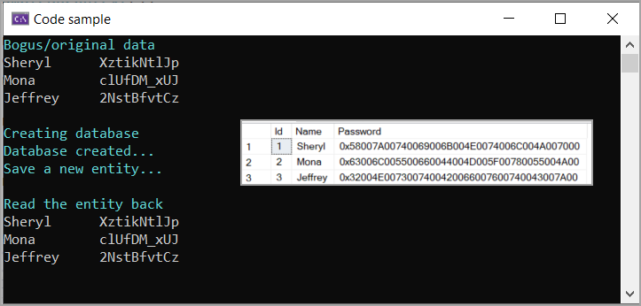

# About

Microsoft [simple starter code sample](https://github.com/dotnet/EntityFramework.Docs/blob/main/samples/core/Modeling/ValueConversions/EncryptPropertyValues.cs) for `HasConversion` which in this case takes a string and reverses the string and stores in the table then read back reverses the value back to what was entered.

**Original conversion**

Which allows a developer to work from a simple example to implement their own logic while in this project a NuGet package is used as per below.

```csharp
modelBuilder.Entity<User>().Property(e => e.Password).HasConversion(
    v => new string(v.Reverse().ToArray()),
    v => new string(v.Reverse().ToArray()));
```

**Current conversion**

The conversion here is done with NuGet package [Inferno](https://www.nuget.org/packages/Inferno/) crypto [library](https://securitydriven.net/inferno/), 

```csharp
modelBuilder.Entity<User>().Property(e => e.Password)
    .HasConversion(
        value => value.ToBytes(),
        value => value.FromBytes());
```



